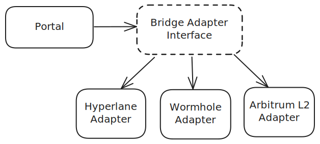
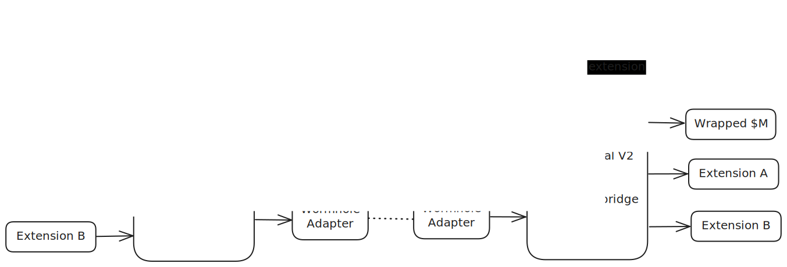

# Portal v2

Portal V2 is an evolution of M0’s cross-chain messaging systems — Portal and Portal Lite — designed to work with multiple messaging providers and across different virtual machines (VMs).

## Architecture

To reduce dependency on the implementations and standards of individual bridging providers, Multi-chain V2 defines a unified interface for a bridging adapter. This adapter can be implemented using various cross-chain protocols, improving flexibility and scalability across the system.

The Portal has no direct knowledge of the underlying bridging implementations when sending or receiving cross-chain messages — all functionality is abstracted behind the adapter interface. Similarly, each Bridge Adapter is unaware of protocol-specific logic; it simply handles sending and receiving byte-encoded messages.

If multiple bridge implementations exist for the same pathway, the admin can configure a default option. Alternatively, the system could allow the message sender to specify the ID of the bridging provider, giving users the ability to choose the transfer protocol.

## System Components

The main contracts of the system are:

- `HubPortal` – deployed on Ethereum. It uses a *lock-and-release* mechanism for token transfers and propagates the $M earning index and TTG registrar values to other chains.
- `SpokePortal` – deployed on all non-Ethereum chains. It uses a *mint-and-burn* mechanism for bridging tokens and updates the $M earning index and TTG registrar values based on messages received from `HubPortal`.
- `Portal` – a base contract inherited by both `HubPortal` and `SpokePortal` containing a shared functionality. It maintains a mapping of destination chain to bridge adapter – `mapping(uint256 destinationChainId => address bridgeAdapter)`, allowing different adapters to be specified for different chains.
- `BridgeAdapter` – an abstract contract that defines the common functionality all bridging adapters must implement.
- *Individual bridge adapters* (e.g., `HyperlaneBridgeAdapter`, `WormholeBridgeAdapter`) – inherit from `BridgeAdapter` contract and implement the specifics of each underlying cross-chain messaging provider.

## Transfer Flow

